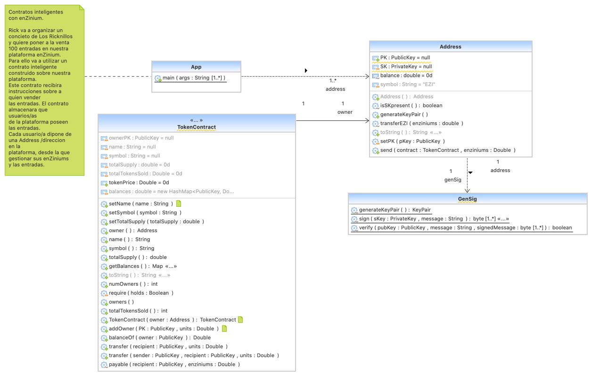

EZINIUM
=======

> Contratos inteligentes con EnZinIum.

Rick va a organizar un concierto de Los Ricknillos y quiere poner a la venta 100 entradas en nuestra plataforma EnZinIum.

Para ello va a utilizar un contrato inteligente construido sobre nuestra plataforma.

Este contrato recibirá instrucciones sobre a quién vender las entradas. 

El contrato almacenará que usuarios/as de la plataforma poseen las entradas.

Cada usuario/a dipone de una `Address` /dirección en la plataforma, desde la que gestionar sus EnZinIums y las entradas.

## Prepara el proyecto

 1. Crea un nuevo repo en tu cuenta en **Github**.
 2. Crea un nuevo directorio en tu equipo y **clona el repositorio** de Github.
 3. Abre VSCode /Eclipse /Netbeans y **establece como workspace** el directorio que has clonado.
 4. Crea un proyecto **Maven** que incluya tu **nombre y apellidos**.
 5. Pon el proyecto en seguimiento en **Git** y configura `.gitignore`.
 5. Copia y pega la función principal `App.java`. Utilízala como guía en el proceso TDD. **No puedes modificar su código**, pero sí puedes comentar aquellas partes que aun no hayas implementado.
 6. Añade al proyecto la clase `GenSig.java` que ofrece varias utilidades que emplearás.
 7. Completa las clases que aquí se indican **implementando los casos test que necesites**. Practica **TDD**.
 8. Realiza `commits` como mínimo cada vez que termines una historia de usuario. 

## Cómo entregar el código

 1. Crea un repo privado en tu GitHub y compártelo con el usuario dfleta.
 2. Desde Eclipse exporta el proyecto a un fichero.
 3. En VSCode, comprime la carpeta del proyecto.
 4. Envíame el archivo por correo electrónico.
 5. **Realiza commits periódicamente** mientras avanzas en el desarrollo de la aplicación.
 6. Realiza un `push` al repo remoto en GitHub **SOLO cuando hayas terminado el proyecto**.

## Salida de la aplicación

Intenta que la salida del programa sea lo más parecida posible a las imágenes que se proporcionan.

## Historias de usuario

Las historias de usuario están enunciadas en el script principal `App.java`

Crea un documento donde escribas las historias de usuario correspondientes a los hitos del proceso.

## Diagrama de clases UML - Opcional

Realiza a mano alzada -o con la aplicación que prefieras- un pequeño diagrama de clases UML que muestre la relación entre las clases que has construído, con su interfaz pública y privada.

## Código

### Clase `Address`

Es la **dirección** que cada usuario tiene en nuestro sistema.

#### Atributos

* `PublicKey PK` es la **clave pública** de la **direccion** desde la que se envían o reciben EnZinIums.
* `PrivateKey SK` es la **clave privada** de la **direccion** desde la que se envían o reciben EnZinIums.
* `balance` es la cantidad de EnZinIums que posee esta dirección.
* `symbol` es el símbolo del EnZinIum: `EZI`.

#### Métodos

Si programas las historias de usuario indicadas en  `App.java` construirás los getters y setters necesarios.

* `toString()` devuelve la representación en `String` de un objeto de la clase `Address`.

* `addEZI(Double EZI)` añade EZI al balance de esta direccion.
* `transferEZI(Double EZI)` transfiere la cantidad de EZI a esta dirección.
* `send(TokenContract contract, Double EZI)` envia EZI desde esta direccion a un contrato inteligente.

### Clase `TokenContract`

Esta clase representa un contrato inteligente en nuestra plataforma.
Lleva un control del numero de tokens que existen de un producto, por ejemplo una entrada de concierto, y a quién pertenecen.
Todo contrato tiene un propietario.

#### Atributos

* Todos los que exijan los métodos de la clase.
* `balances` contiene una tabla que hace el seguimiento de cuántos tokens pertenecen a cada propietario. 

#### Métodos

* `name` devuelve el nombre del token de forma  _human-readable_ (p.e., “US Dollars”).
* `symbol()` devuelve el nombre del símbolo del token de forma _human-readable_ (p.e., “USD”).
* `totalSupply()` devuelve el total de unidades de este token que actualmente existen.

* `addOwner(PublicKey PK, Double units)` añade un propietario a `balances`.
* `numOwners()` devuelve el numero de propietarios en  `balances`
* `balanceOf(PublicKey owner)` devuelve el numero de tokens de un propietario.
* `transfer(PublicKey recipient, Double units)` transfiere tokens del propietario del contrato a la dirección de destino.
* `transfer(PublicKey sender, PublicKey recipient, Double units)` transfiere tokens del sender al recipient.
* `require(Boolean holds) throws Exception` lanza una excepción cuando holds es `false`.
* `owners()` mueestra en consola todos los propietarios.
* `payable(PublicKey recipient, Double EnZinIums)` envia los tokens a la direccion recipient y envia los EnZinIums al propietario del contrato.

### Clase `GenSig`

Esta clase contiene las utilidades para generar el par de clave pública y privada asociados a toda direccion `Address` de nuestra sistema.

**NO puedes modificar su código**

La documentación de cada utilidad se encuentra en la propia clase.